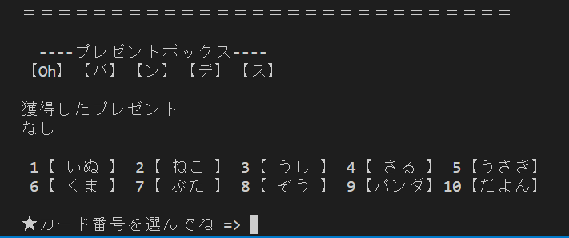

# ハイ＆ローゲーム

### 使用言語
 Java

### 目的
オブジェクト指向のアウトプット

### ゲームのルール
※ミヤギテレビのローカルワイド番組『OH!バンデス』内のいちコーナーである「あなたのバンです!ハイ&ロー」ゲームを再現したものになります。 
 
1. まず初めに、10種類のカードのうち表面に「だよん（ミヤギテレビのマスコットキャラクター）」が書かれたカード（だよんカード）のみ、事前に裏面の数字が公開される。 
1. プレイヤーは用意されている10種類のカードの中から1枚のカードを選択し、そのカードが持っている1から10までの数字を確認する。 
1. 次に別のカードを選択し、そのカードが持っている数字が1つ前に選択したカードの数字よりも上か下かを推測して解答する。

1. 正解すると、景品が隠されている5種類の箱（｢Oh｣｢バ｣｢ン｣｢デ｣｢ス｣の文字が振られている）の中から1つを選択してその中の景品を獲得することができる。
    - 1回目のゲームに正解すると、引き続き別のカードを選択して2回目のゲームに挑戦するかどうかを決定する権利が与えられる。
    
        - もし2回目のゲームにも挑戦して正解すれば、続いて3回目のゲームにも挑戦するかどうかを決定する権利が与えられる。
        
    - 途中でゲームを降りた場合は、その時点まで選択した景品を正式に獲得して終了となる。
    
    - 引き続きゲームに挑戦して不正解となった場合はそれまで獲得した景品は全て没収されて終了となる。
    
    - 3回連続で正解したらゲーム終了となり、景品を3つ正式に獲得できる。
    
    - 事前に数字が公開されている「だよんカード」をうまく使うことで1回は確実に正解することが可能。
